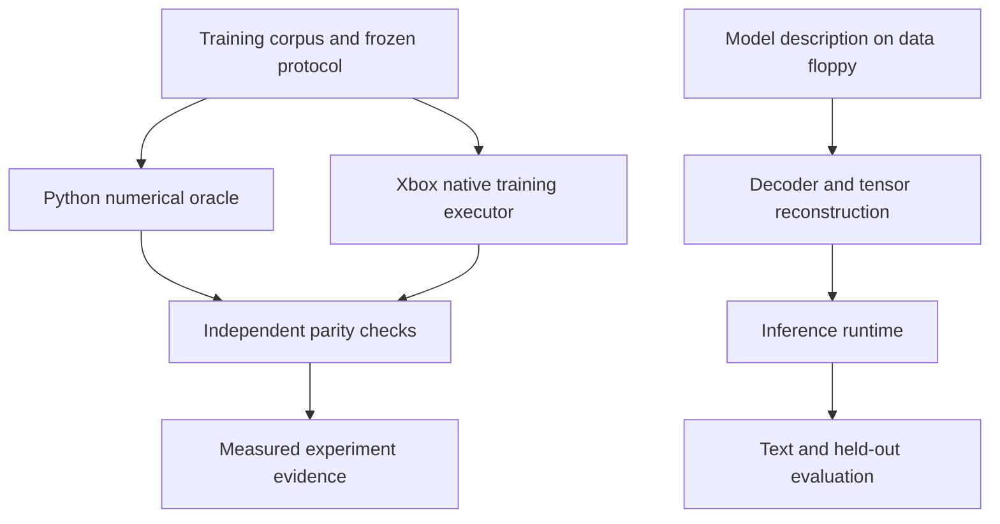

# Architecture: description, reconstruction and inference

FloppyLM asks how much language-model quality can be encoded in a fixed disk budget.
The stored representation describes a model; the execution machine reconstructs numerical tensors
and evaluates them. Disk size, peak RAM and execution time are separate constraints.
The [budget ADR](adr/0001-floppy-budget.md) owns the exact counting rule.

## Two paths with different roles

The research path qualifies implementations and compares models. The artifact path is the final
execution target. This diagram describes responsibilities; it does not assert that the final C
runtime or vector language model has been implemented. Live capability is in [STATUS](STATUS.md).

## Responsibility map

| Layer | Source | Responsibility and boundary |
| --- | --- | --- |
| Model oracle | `src/floppylm/model.py`, `codec.py`, `train.py` | Scalar GPT semantics, quantized reconstruction and reference training |
| Serialization | `src/floppylm/pack.py`, `rans.py` | FLP2 scalar artifacts, canonical reconstruction and actual bytes |
| Vector qualification | `src/floppylm/vq.py` | Fixed/learned books, assignments and VQF1 functional fixtures; not an FLP2 vector model |
| Experiment control | `experiments/`, `runlog.py`, `parity.py` | Configuration, run identity, selection, eligibility and paired differences |
| Backend interface | `schemas/`, `src/floppylm_xbox/` | Host operations and versioned exchange contracts |
| Native execution | Separate `xbox-gpu-training` repository | DX12/UWP executor consuming FloppyLM semantics; see ADR 0012 |
| Final artifact | E3/E4 in the roadmap | Static C runtime, tokenizer and model on a mounted FAT12 data floppy |

## What a vector code stores

Instead of storing every weight independently, a vector codec stores an index for each group.
A decoder maps each index to a vector and applies recorded scales. A learned book also stores its
entries. A fixed generated book stores its identity/seed and relies on decoder code. “Zero codebook
payload” therefore never means that headers, seeds, scales or decoder binary bytes are free.

Distinguish three quantities: unique reconstructed weights; bytes describing those weights; and
operations performed when shared weights are reused. Recursion increases executed depth, not the
number of independently stored weights. Nominal index bits per weight exclude other components;
actual artifact size includes them.

## Verification boundaries

Canonical serialization requires `pack(unpack(blob)) == blob`. Exact integer/code paths and declared
floating-point numerical tolerances have different gates; floating-point kernels are governed by
[ADR 0010](adr/0010-independent-numerical-gates.md). Do not claim universal cross-device bit identity.
The final runtime must independently reproduce the declared reconstruction and evaluation within
its accepted gates. A host test pass is not native GPU acceptance or a disk demonstration.

[Roadmap](roadmap.md) defines experiment gates; [excellence plan](excellence-plan.md) lists review work.
