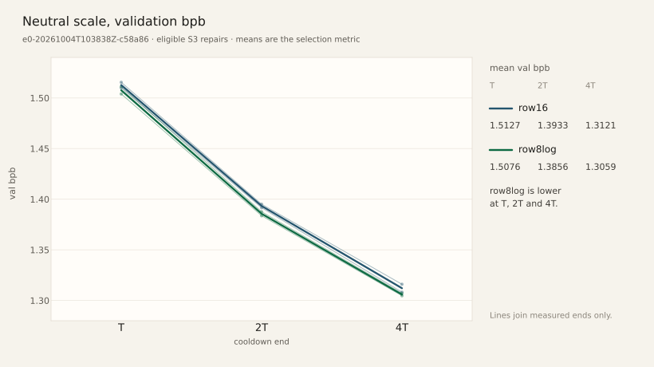
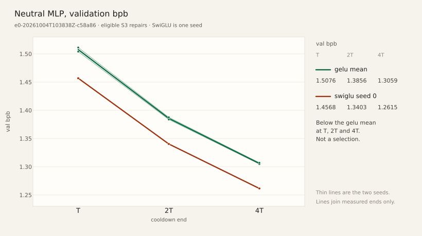

# Evidence

This directory owns the **numbers**. A claim that something "works" without a file here is theatre.
Records are frozen: they may only be translated or receive a dated "Later note" pointer at the end.
Host-absolute paths inside records are normalized to repository-relative paths.

## Layout

```
evidence/e0-v2/runs/<run_id>/
  summary.json     # state, config, bytes and hashes per cooldown, val bpb, saturation, compute
  notes.md         # one generated page: setup, results, what was not measured
evidence/e0-v2/campaigns/<campaign_id>/      # generated campaign report (summary.json, notes.md)
evidence/e0-v2/selections/<name>.json        # frozen selection with artifact hashes
evidence/e0-v2/selections/<name>.test.json   # final test, once per selection
evidence/xbox-e0-YYYYMMDD[-tag]/             # hand-written package acceptance: notes.md + JSON proofs
evidence/e0-lite/pre-v2/                     # stopped pre-v2 grid, diagnostic only
evidence/e1-qualification-YYYYMMDD/          # E1 functional qualification (ADR 0013), not scientific E1
```

The full manifest, state and artifacts of each run live in `runs/<run_id>/` (outside Git; only
`/runs/` at the root is ignored). Historical `smoke-functional*.json` selections predate ADR 0007
and remain unchanged. New selections declare `purpose: scientific | functional`; smoke runs require
`--freeze ... --functional` and cannot certify a scientific baseline. Run summaries stay partial
until host retrieval and evaluation complete.

[Historical report corrections](e0-report-corrections-20261003/notes.md) distinguish
attempt recipes/eligibility from trial outcomes without overwriting frozen records.

### Figures

A figure is a view of published run summaries. The numbers stay in those records.
[`scripts/e0_figures.py`](../../scripts/e0_figures.py) draws the files below from those
summaries. Matplotlib is the optional `plots` extra and is not part of CI.



Eligible S3 repairs from `e0-20261004T103838Z-c58a86`. The mean at each cooldown end is the ADR 0015 selection metric; the dots are the two seeds. `row8log` is lower at T, 2T and 4T. The source records are `000-repair`, `001-repair`, `002-repair` and `003-repair`.



Same campaign, eligible MLP repairs only. The green mean is the two gelu seeds, which repeat the `row8log` repairs. The rust mean is the two SwiGLU seeds, 1.4631/1.3473/1.2704, lower at T, 2T and 4T, and is the recorded choice at nominal `d_ff` 274. The purple mean is the two ReLU² seeds, 1.4770/1.3638/1.2822. Tuning cells stay in the index and off this figure.

## Inventory

### E0 v2 runs and campaigns

| Evidence                                                                                                                                    | Kind                                                                 | State       |
| ------------------------------------------------------------------------------------------------------------------------------------------- | -------------------------------------------------------------------- | ----------- |
| [`e0-v2/runs/smoke-ternary-d32-l1-f48-s0-20260930T081747Z-973ccb`](e0-v2/runs/smoke-ternary-d32-l1-f48-s0-20260930T081747Z-973ccb/notes.md) | smoke, **functional proof, not scientific**                          | completed   |
| `e0-v2/runs/smoke-ternary-d32-l1-f48-s0-20260930T081826Z-e393da`                                                                            | SIGTERM path test, smoke interrupted on purpose                      | interrupted |
| `e0-v2/selections/smoke-functional*.json`                                                                                                   | functional proof of `--freeze` / `--final-test` on smoke             | —           |
| [`e0-v2/campaigns/e0-20261001T074326Z-503df0`](e0-v2/campaigns/e0-20261001T074326Z-503df0/notes.md)                                         | first scientific campaign, package 0.1.0.24                          | stopped     |
| [`e0-v2/campaigns/e0-20261001T090514Z-4236fd`](e0-v2/campaigns/e0-20261001T090514Z-4236fd/notes.md) | E0.1 campaign, package 0.1.0.28; stopped at `neutral-scale` (saturation) | stopped |
| `e0-v2/runs/e0-20261001T074326Z-503df0-000`                                                                                                 | its only trial, checkpointed at trunk step 455                       | stopped     |
| [`e0-v2/runs/e0-20261001T090514Z-4236fd-000`](e0-v2/runs/e0-20261001T090514Z-4236fd-000/notes.md) | campaign `4236fd` trial 0 (row16, seed 0): bytes −1.3%, not saturated | excluded |
| [`e0-v2/runs/e0-20261001T090514Z-4236fd-000-repair`](e0-v2/runs/e0-20261001T090514Z-4236fd-000-repair/notes.md) | its S3 byte repair: byte parity met, Δ(2T→4T) = −0.079, not saturated | excluded |
| [`e0-v2/runs/e0-20261001T090514Z-4236fd-001`](e0-v2/runs/e0-20261001T090514Z-4236fd-001/notes.md) | trial 001 (row16, seed 1): bytes −1.3%, Δ(2T→4T) = −0.085, not saturated | completed |
| `e0-v2/runs/e0-20261001T090514Z-4236fd-001-repair` | its byte repair, stopped with the campaign at trunk step 162 | interrupted |
| [`e0-v2/runs/e0-20261001T163456Z-fdab67-000`](e0-v2/runs/e0-20261001T163456Z-fdab67-000/notes.md) | `fdab67` on 0.1.0.56, row16 seed 0: bytes short, not saturated. No campaign report was written | excluded |
| [`e0-v2/runs/e0-20261001T163456Z-fdab67-000-repair`](e0-v2/runs/e0-20261001T163456Z-fdab67-000-repair/notes.md) | its S3 repair: parity met, val bpb 1.5155/1.3951/1.3160, Δ(2T→4T) = −0.079 | eligible |
| `e0-v2/runs/e0-20261001T163456Z-fdab67-001` | seed 1 interrupted before a cooldown | interrupted |
| [`e0-v2/campaigns/e0-20261002T072408Z-40a67c`](e0-v2/campaigns/e0-20261002T072408Z-40a67c/notes.md) | campaign on 0.1.0.80; trial 000 interrupted before a cooldown | stopped |
| `e0-v2/runs/e0-20261002T072408Z-40a67c-000` | that trial: Xbox job interrupted, not a result | failed |
| [`e0-v2/campaigns/e0-20261002T090742Z-2fe64f`](e0-v2/campaigns/e0-20261002T090742Z-2fe64f/notes.md) | campaign on 0.1.0.86; seed 0 repair eligible, seed 1 interrupted | stopped |
| [`e0-v2/runs/e0-20261002T090742Z-2fe64f-000`](e0-v2/runs/e0-20261002T090742Z-2fe64f-000/notes.md) | row16 seed 0: bytes short, not saturated | excluded |
| [`e0-v2/runs/e0-20261002T090742Z-2fe64f-000-repair`](e0-v2/runs/e0-20261002T090742Z-2fe64f-000-repair/notes.md) | S3 repair, same artifacts as `fdab67-000-repair`, Δ(2T→4T) = −0.079 | eligible |
| `e0-v2/runs/e0-20261002T090742Z-2fe64f-001` | seed 1 interrupted before a cooldown; do not recover | interrupted |
| [`e0-v2/campaigns/e0-20261002T191632Z-ca781f`](e0-v2/campaigns/e0-20261002T191632Z-ca781f/notes.md) | campaign on 0.1.0.93; both row16 seeds eligible; trial 002 interrupted | stopped |
| [`e0-v2/runs/e0-20261002T191632Z-ca781f-000`](e0-v2/runs/e0-20261002T191632Z-ca781f-000/notes.md) | row16 seed 0: bytes short, val bpb 1.5148/1.3938/1.3120 | excluded |
| [`e0-v2/runs/e0-20261002T191632Z-ca781f-000-repair`](e0-v2/runs/e0-20261002T191632Z-ca781f-000-repair/notes.md) | S3 repair, same artifacts as `fdab67-000-repair`, eligible | eligible |
| [`e0-v2/runs/e0-20261002T191632Z-ca781f-001`](e0-v2/runs/e0-20261002T191632Z-ca781f-001/notes.md) | row16 seed 1: bytes short, val bpb 1.5273/1.4052/1.3204 | excluded |
| [`e0-v2/runs/e0-20261002T191632Z-ca781f-001-repair`](e0-v2/runs/e0-20261002T191632Z-ca781f-001-repair/notes.md) | S3 repair eligible, val bpb 1.5100/1.3916/1.3082, Δ(2T→4T) = −0.083 | eligible |
| `e0-v2/runs/e0-20261002T191632Z-ca781f-002` | `row8log` `d_ff` 415, interrupted at the start, not a result | interrupted |
| [`e0-v2/campaigns/e0-20261003T104407Z-a8d8b9`](e0-v2/campaigns/e0-20261003T104407Z-a8d8b9/notes.md) | campaign on 0.1.0.98; stopped, no completed baseline | stopped |
| `e0-v2/runs/e0-20261003T104407Z-a8d8b9-000` | interrupted before a branch result | interrupted |
| [`e0-v2/campaigns/e0-20261004T082243Z-31972d`](e0-v2/campaigns/e0-20261004T082243Z-31972d/notes.md) | campaign on 0.1.0.102; stopped at published trunk 2112 | stopped |
| `e0-v2/runs/e0-20261004T082243Z-31972d-000` | interrupted after the T and 2T artifacts, no 4T result | interrupted |
| [`e0-v2/runs/e0-20261004T103838Z-c58a86-000`](e0-v2/runs/e0-20261004T103838Z-c58a86-000/notes.md) | row16 seed 0 on 0.1.0.105: bytes short, val bpb 1.5148/1.3938/1.3120 | excluded |
| [`e0-v2/runs/e0-20261004T103838Z-c58a86-000-repair`](e0-v2/runs/e0-20261004T103838Z-c58a86-000-repair/notes.md) | S3 repair eligible, val bpb 1.5155/1.3951/1.3160, Δ(2T→4T) = −0.079 | eligible |
| [`e0-v2/runs/e0-20261004T103838Z-c58a86-001`](e0-v2/runs/e0-20261004T103838Z-c58a86-001/notes.md) | row16 seed 1: bytes short, val bpb 1.5273/1.4052/1.3204 | excluded |
| [`e0-v2/runs/e0-20261004T103838Z-c58a86-001-repair`](e0-v2/runs/e0-20261004T103838Z-c58a86-001-repair/notes.md) | S3 repair eligible, val bpb 1.5100/1.3916/1.3082, Δ(2T→4T) = −0.083 | eligible |
| [`e0-v2/runs/e0-20261004T103838Z-c58a86-002`](e0-v2/runs/e0-20261004T103838Z-c58a86-002/notes.md) | row8log seed 0, `d_ff` 415: bytes short, val bpb 1.5183/1.3921/1.3064 | excluded |
| [`e0-v2/runs/e0-20261004T103838Z-c58a86-002-repair`](e0-v2/runs/e0-20261004T103838Z-c58a86-002-repair/notes.md) | S3 repair eligible, `d_ff` 424, val bpb 1.5039/1.3837/1.3047, Δ(2T→4T) = −0.079 | eligible |
| [`e0-v2/runs/e0-20261004T103838Z-c58a86-003`](e0-v2/runs/e0-20261004T103838Z-c58a86-003/notes.md) | row8log seed 1, `d_ff` 415: bytes short, val bpb 1.5143/1.4011/1.3211 | excluded |
| [`e0-v2/runs/e0-20261004T103838Z-c58a86-003-repair`](e0-v2/runs/e0-20261004T103838Z-c58a86-003-repair/notes.md) | S3 repair eligible, `d_ff` 424, val bpb 1.5112/1.3876/1.3070, Δ(2T→4T) = −0.081 | eligible |
| [`e0-v2/runs/e0-20261004T103838Z-c58a86-004`](e0-v2/runs/e0-20261004T103838Z-c58a86-004/notes.md) | gelu row8log seed 0, `d_ff` 415: bytes short, same val bpb as `002` (1.5183/1.3921/1.3064) | excluded |
| [`e0-v2/runs/e0-20261004T103838Z-c58a86-004-repair`](e0-v2/runs/e0-20261004T103838Z-c58a86-004-repair/notes.md) | S3 repair eligible, `d_ff` 424, same artifacts as `002-repair`, val bpb 1.5039/1.3837/1.3047, Δ(2T→4T) = −0.079 | eligible |
| [`e0-v2/runs/e0-20261004T103838Z-c58a86-005`](e0-v2/runs/e0-20261004T103838Z-c58a86-005/notes.md) | gelu row8log seed 1, `d_ff` 415: bytes short, same val bpb as `003` (1.5143/1.4011/1.3211) | excluded |
| [`e0-v2/runs/e0-20261004T103838Z-c58a86-005-repair`](e0-v2/runs/e0-20261004T103838Z-c58a86-005-repair/notes.md) | S3 repair eligible, `d_ff` 424, same artifacts as `003-repair`, val bpb 1.5112/1.3876/1.3070, Δ(2T→4T) = −0.081 | eligible |
| [`e0-v2/runs/e0-20261004T103838Z-c58a86-006`](e0-v2/runs/e0-20261004T103838Z-c58a86-006/notes.md) | SwiGLU row8log seed 0, `d_ff` 274: bytes short, val bpb 1.4661/1.3433/1.2616 | excluded |
| [`e0-v2/runs/e0-20261004T103838Z-c58a86-006-repair`](e0-v2/runs/e0-20261004T103838Z-c58a86-006-repair/notes.md) | S3 repair eligible, `d_ff` 280, val bpb 1.4568/1.3403/1.2615, Δ(2T→4T) = −0.079; SwiGLU seed 0 | eligible |
| [`e0-v2/runs/e0-20261004T103838Z-c58a86-007`](e0-v2/runs/e0-20261004T103838Z-c58a86-007/notes.md) | SwiGLU row8log seed 1, `d_ff` 274: bytes short, val bpb 1.4642/1.3546/1.2748 | excluded |
| [`e0-v2/runs/e0-20261004T103838Z-c58a86-007-repair`](e0-v2/runs/e0-20261004T103838Z-c58a86-007-repair/notes.md) | S3 repair eligible, `d_ff` 280, val bpb 1.4694/1.3544/1.2793, Δ(2T→4T) = −0.075; SwiGLU seed 1 | eligible |
| [`e0-v2/runs/e0-20261004T103838Z-c58a86-008`](e0-v2/runs/e0-20261004T103838Z-c58a86-008/notes.md) | ReLU² row8log seed 0, `d_ff` 415: bytes short, val bpb 1.4723/1.3578/1.2701 | excluded |
| [`e0-v2/runs/e0-20261004T103838Z-c58a86-008-repair`](e0-v2/runs/e0-20261004T103838Z-c58a86-008-repair/notes.md) | S3 repair eligible, `d_ff` 424, val bpb 1.4749/1.3597/1.2807, Δ(2T→4T) = −0.079; ReLU² seed 0 | eligible |
| [`e0-v2/runs/e0-20261004T103838Z-c58a86-009`](e0-v2/runs/e0-20261004T103838Z-c58a86-009/notes.md) | ReLU² row8log seed 1, `d_ff` 415: bytes short, val bpb 1.4904/1.3728/1.2931 | excluded |
| [`e0-v2/runs/e0-20261004T103838Z-c58a86-009-repair`](e0-v2/runs/e0-20261004T103838Z-c58a86-009-repair/notes.md) | S3 repair eligible, `d_ff` 423, val bpb 1.4790/1.3679/1.2837, Δ(2T→4T) = −0.084; ReLU² seed 1 | eligible |
| [`e0-v2/runs/e0-20261004T103838Z-c58a86-010`](e0-v2/runs/e0-20261004T103838Z-c58a86-010/notes.md) | ternary lr 0.001, delta 0.5, seed 0, `d_ff` 274: bytes short, val bpb 1.5810/1.4346/1.3351 | excluded |
| [`e0-v2/runs/e0-20261004T103838Z-c58a86-010-repair`](e0-v2/runs/e0-20261004T103838Z-c58a86-010-repair/notes.md) | S3 repair eligible, `d_ff` 279, val bpb 1.5987/1.4543/1.3442, Δ(2T→4T) = −0.110; lr 0.001, delta 0.5 | eligible |
| [`e0-v2/runs/e0-20261004T103838Z-c58a86-011`](e0-v2/runs/e0-20261004T103838Z-c58a86-011/notes.md) | ternary lr 0.001, delta 0.7, seed 0, `d_ff` 274: bytes short, val bpb 1.5830/1.4460/1.3383 | excluded |
| [`e0-v2/runs/e0-20261004T103838Z-c58a86-011-repair`](e0-v2/runs/e0-20261004T103838Z-c58a86-011-repair/notes.md) | S3 repair eligible, `d_ff` 288, val bpb 1.5771/1.4326/1.3301, Δ(2T→4T) = −0.103; lr 0.001, delta 0.7 | eligible |
| [`e0-v2/runs/e0-20261004T103838Z-c58a86-012`](e0-v2/runs/e0-20261004T103838Z-c58a86-012/notes.md) | ternary lr 0.003, delta 0.5, seed 0, `d_ff` 274: same recipe as `006`, different artifact, bytes short, val bpb 1.4660/1.3503/1.2730 | excluded |
| [`e0-v2/runs/e0-20261004T103838Z-c58a86-012-repair`](e0-v2/runs/e0-20261004T103838Z-c58a86-012-repair/notes.md) | S3 repair eligible, `d_ff` 279, val bpb 1.4829/1.3593/1.2772, Δ(2T→4T) = −0.082; lr 0.003, delta 0.5 | eligible |
| [`e0-lite/pre-v2`](e0-lite/pre-v2/notes.md)                                                                                                 | stopped E0-lite grid; diagnostic, excluded from verdicts, FLP1 blobs | —           |

### Xbox package acceptance

| Evidence                                                      | Package  | Scope                                                                                     |
| ------------------------------------------------------------- | -------- | ----------------------------------------------------------------------------------------- |
| [xbox-e0-20260930](xbox-e0-20260930/notes.md)                 | 0.1.0.11 | fixtures, optimizer, resume, first throughput, zero-row diagnostic                        |
| [xbox-e0-20260930-kernels](xbox-e0-20260930-kernels/notes.md) | 0.1.0.19 | 52 per-operation cases after kernel fixes                                                 |
| [xbox-e0-20261001](xbox-e0-20261001/notes.md)                 | 0.1.0.24 | full acceptance, worker, recovery, real suspension, data reproducibility, campaign launch |
| [xbox-e0-20261001-e01](xbox-e0-20261001-e01/notes.md)         | 0.1.0.28 | E0.1 acceptance, worker, recovery, lifecycle, throughput                                  |
| [xbox-e0-20261001-dashboard](xbox-e0-20261001-dashboard/notes.md) | 0.1.0.56 | full hardware gates, pinned deployment, bit identity, screenshot; idle attribution open |
| [xbox-e0-20261001-068](xbox-e0-20261001-068/notes.md) | 0.1.0.68 | PR 31 dashboard; full hardware gates, bit-identical to 0.1.0.56; fence still INFINITE |
| [xbox-e0-20261002-080](xbox-e0-20261002-080/notes.md) | 0.1.0.80 | PR 32 liveness + PR 30 fence-timeout; full hardware gates, bit-identical to 0.1.0.56/0.1.0.68 |
| [xbox-e0-20261002-086](xbox-e0-20261002-086/notes.md) | 0.1.0.86 | PR 34 drop EE + PR 33 DisplayRequest; full hardware gates including lifecycle; bit-identical to 0.1.0.56/0.1.0.68/0.1.0.80 |
| [xbox-e0-20261002-093](xbox-e0-20261002-093/notes.md) | 0.1.0.93 | PR 37 fence poll wait + PR 35 `loss_series`; full hardware gates; bit-identical 38/38 vs 0.1.0.56/0.1.0.68/0.1.0.80/0.1.0.86 |
| [xbox-e0-20261003-095](xbox-e0-20261003-095/notes.md) | 0.1.0.95 | PR 38 published-fence watchdog; full hardware gates; bit-identical 38/38 vs 0.1.0.56/0.1.0.68/0.1.0.80/0.1.0.86/0.1.0.93 |
| [xbox-e0-20261003-098](xbox-e0-20261003-098/notes.md) | 0.1.0.98 | claim validation and resume binding; full hardware gates; bit-identical 38/38 vs 0.1.0.95 |
| [xbox-e0-20261004-102](xbox-e0-20261004-102/notes.md) | 0.1.0.102 | published-fence `progress_stall` classification; full hardware gates; bit-identical 38/38 vs 0.1.0.98 |
| [xbox-e0-20261004-105](xbox-e0-20261004-105/notes.md) | 0.1.0.105 | checkpoint publish without a stable empty temporary; full hardware gates; bit-identical 38/38 vs 0.1.0.102 |
| [architecture-20261002](architecture-20261002/) | CPU | S3 coded/nominal fill on `2fe64f-000` vs repair; E1 1/16 VQ book-fit table. Proposals, not ADRs. |

### E1 functional qualification

[e1-qualification-20261001](e1-qualification-20261001/notes.md): CPU scalar profiling, BPE512
round trips, vector storage/reconstruction probes and deterministic partial-quantization canaries
under [ADR 0013](../adr/0013-e1-functional-qualification.md). It is neither scientific E1 nor Xbox
vector acceptance; the producing code is `scripts/e1_qualify.py` on `main`.

A dated narrative of these packages is in the [archive](../archive/xbox-e0-history.md).
`ca781f` is the first row16 pair with both seeds eligible under ADR 0015. The rest of the E0
grid, paired σ and the held-out test remain open; the [roadmap](../roadmap.md) defines those gates.

Real-deadline watchdog: [xbox-e0-20261003-098](xbox-e0-20261003-098/notes.md), complete functional qualification with exact recovery and preservation evidence. The [0.1.0.96 incomplete attempt](xbox-e0-20261003-096-incomplete/notes.md) records the defect discovered before the final qualification. [xbox-e0-20261004-102](xbox-e0-20261004-102/notes.md) records the parked probe as `progress_stall` with requested fence 0, bit-identical to 0.1.0.98. [xbox-e0-20261004-105](xbox-e0-20261004-105/notes.md) is the accepted successor: the same classification, bit-identical 38/38 versus 0.1.0.102, shader unchanged. The large checkpoint publish no longer truncates a stable temporary. The scientific 600 s stall is not yet shown to be gone.

[E0 readiness, 2026-10-03](e0-readiness-20261003/notes.md): integrated fixes, read-only
Odroid observation, corpus/protocol binding and cost envelope; no campaign launched.
